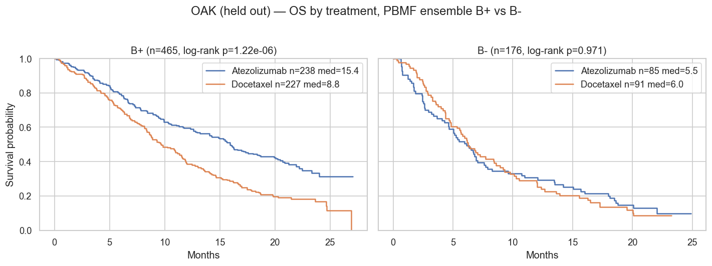
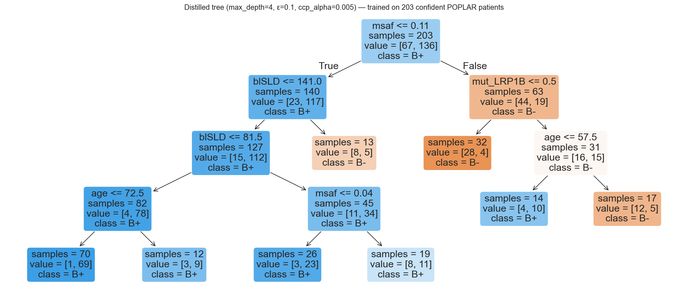
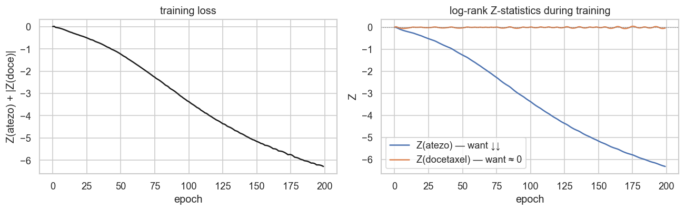

# PBMF reproduction

An independent, educational reproduction of the **Predictive Biomarker Modeling Framework (PBMF)** applied to the POPLAR (Phase 2) → OAK (Phase 3) NSCLC atezolizumab-vs-docetaxel case study.

Written over a single afternoon by a software engineer (not a biologist) trying to build mechanical intuition for how the method works — ensemble training with a differentiable log-rank contrastive loss, consensus-based pruning, and knowledge distillation into an interpretable decision tree. The reproduction matches the paper's headline held-out result (HR+/HR- ≈ 0.58 on OAK) and recovers the same MSAF + tumor-burden + mutation rule structure, though with slightly different specific genes (see "What matches and what differs" below).

## The headline result

On held-out OAK (Phase 3, n=641), the learned biomarker cleanly separates patients into a large B+ group where atezolizumab extends median OS by ~6 months vs docetaxel, and a B- group where the two drugs perform identically:



The full ensemble is then distilled into a readable four-level decision tree so the rule can be audited by a human:



Regenerate both figures yourself with `uv run python scripts/generate_figures.py` after downloading the data.

## Citation

All intellectual credit for the method belongs to the PBMF authors. Their official implementation lives at [github.com/gaarangoa/pbmf](https://github.com/gaarangoa/pbmf) — consult it for anything beyond educational exploration.

```bibtex
@article{arango2025ai,
  title={AI-driven predictive biomarker discovery with contrastive learning to improve clinical trial outcomes},
  author={Arango-Argoty, Gustavo and Bikiel, Damian E and Sun, Gerald J and Kipkogei, Elly and Smith, Kaitlin M and Pro, Sebastian Carrasco and Choe, Elizabeth Y and Jacob, Etai},
  journal={Cancer Cell},
  year={2025},
  publisher={Elsevier}
}
```

The clinical data used here comes from Gandara et al., *Nature Medicine* 2018 ([doi:10.1038/s41591-018-0134-3](https://doi.org/10.1038/s41591-018-0134-3)) — see download instructions below.

## Quick start

```bash
# 1. Download the Gandara 2018 supplementary data file and place it in the repo root
curl -L -o 41591_2018_134_MOESM3_ESM.xlsx \
  "https://static-content.springer.com/esm/art%3A10.1038%2Fs41591-018-0134-3/MediaObjects/41591_2018_134_MOESM3_ESM.xlsx"

# 2. Install dependencies (requires uv: https://github.com/astral-sh/uv)
uv sync

# 3. Launch Jupyter
uv run jupyter lab
```

## Notebook order

Each notebook is self-contained and runnable top-to-bottom. Recommended reading order:

1. **`explore.ipynb`** — raw data tour: what's in the Excel sheets, how treatment arms and censoring are coded, basic KM curves per trial.
2. **`baseline.ipynb`** — the bTMB ≥ 16 cutoff as a predictive biomarker (reproducing the Gandara 2018 claim). On OAK this shows HR+/HR- ≈ 0.91 and interaction p ≈ 0.48 — a weak signal, which motivates PBMF.
3. **`pbmf_single.ipynb`** — one neural biomarker trained end-to-end with a differentiable log-rank contrastive loss. Shows that a single model overfits POPLAR and doesn't transfer cleanly to OAK — motivating the ensemble. Training curves for this stepping-stone model:

   

4. **`pbmf_ensemble.ipynb`** — the full PBMF training recipe: M=1000 bagged models, consensus-based pruning (no held-out labels needed), mean aggregation. Held-out OAK HR+/HR- ≈ 0.58.
5. **`pbmf_distill.ipynb`** — knowledge distillation into a readable decision tree (max_depth=4). Trades ~5% of predictive signal (tree HR+/HR- ≈ 0.61) for a human-readable rule involving MSAF, blSLD, LRP1B, and age.

## Package layout

```
pbmf/
  data.py    # load POPLAR/OAK + variant sheets, build the 29-feature matrix
  eval.py    # evaluate_biomarker() and plot_km_strata() helpers
  model.py   # differentiable log-rank loss, PBMFNet, bagged ensemble,
             # consensus pruning, and tree distillation
```

## What matches and what differs from the paper

**Matches:**
- Ensemble held-out HR(B+) on OAK: ours 0.585 vs paper 0.59
- Distilled tree HR(B+) on OAK: ours 0.578 vs paper 0.55
- Root split of the distilled tree: MSAF ≤ 0.11 in both
- Tumor-burden split: blSLD ≤ 141.5 (ours) vs 140.5 (paper)
- Same broad tree structure (low-MSAF → tumor-burden refinement, high-MSAF → mutation-gated rescue branch)

**Differs:**
- Our B+ prevalence on OAK is ~72% vs paper's 64% — our tree is less selective
- Our distilled tree uses LRP1B + age on the high-MSAF branch; the paper's uses KMT2D, TSC1, ATM, PDGFRA. KMT2D (under its older name MLL2) and TSC1/ATM are present in our feature set but are outcompeted on Gini gain by LRP1B + continuous features at every candidate split. PDGFRA (rank 54 by prevalence) falls outside our top-20 gene selection.
- These differences are consistent with the paper's own observation that the distilled tree is not unique — small variations in ensemble init and pruning shift which specific mutations a greedy tree selects, while the underlying predictive signal is preserved.

## Disclaimer

This is an independent reproduction for educational purposes, written while learning. It is not peer-reviewed, not a clinical tool, and must not be used for patient care or treatment decisions. All clinical data and figures derived from the data remain the property of the original authors and sponsors. The copyrighted supplementary data file is not included in this repository — users must download it themselves from the publisher link above.

## License

Code in this repository is licensed under the MIT License. See [LICENSE](LICENSE). The license applies only to original code authored for this reproduction, not to any data or paper content referenced.
